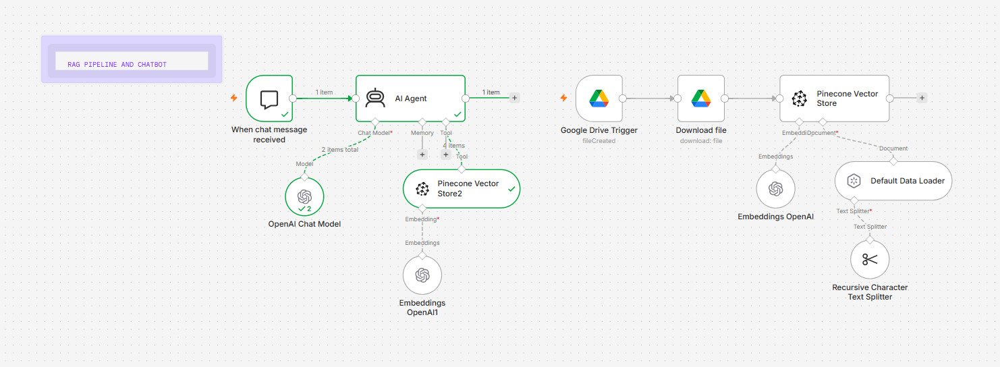
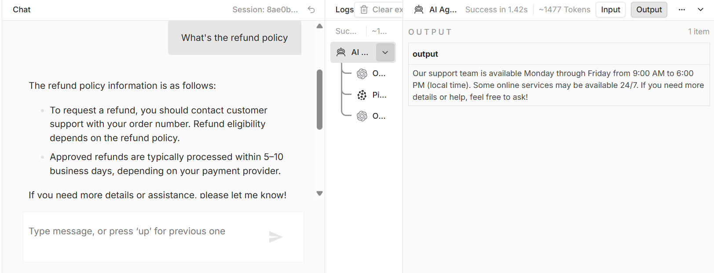

# n8n RAG Chatbot

A Retrieval-Augmented Generation (RAG) chatbot built with n8n that automatically 
syncs documents from Google Drive, generates embeddings, and answers questions 
using an AI Agent.

## Stack
- n8n (workflow automation)
- Google Drive (document source)
- OpenAI (embeddings + chat model)
- Pinecone (vector database)

## How it works
1. Google Drive Trigger detects new/changed files
2. File is downloaded and chunked
3. Chunks are embedded via OpenAI and stored in Pinecone
4. AI Agent retrieves relevant context and answers user questions in real time

## Screenshots

**Workflow architecture:**

**Chatbot in action:**

## Setup
1. Import `My workflow.json` into your n8n instance
2. Add credentials: Google Drive OAuth2, OpenAI API key, Pinecone API key
3. Create a Pinecone index matching your embedding model's dimensions 
   (1536 for OpenAI text-embedding-ada-002)
4. Activate the workflow
